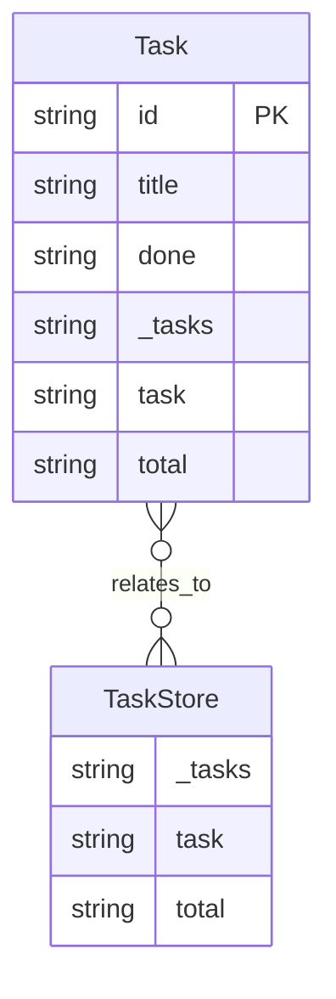

# I1 Report — fixture-repo

## entities

2 entities scanned: Task, TaskStore

## primary_keys

- **Task**: ['id']
- **TaskStore**: []

## relationships

- Task → TaskStore (relates_to)

## sources

- `app/store.py:9` — Task
- `app/store.py:16` — TaskStore

## mermaid_diagram

