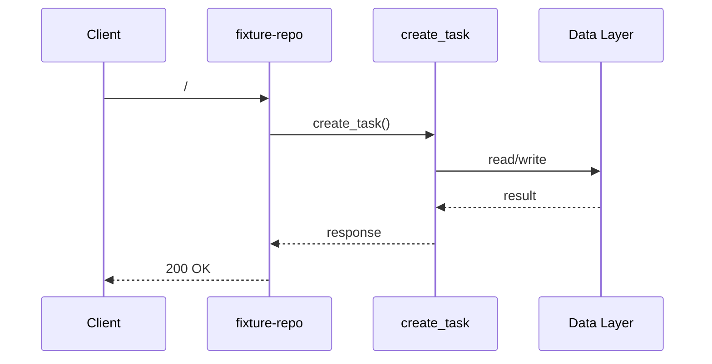

# I2 Report — fixture-repo

## entry_point

`app/main.py:1` — `create_task`

## trace_path

1. `app/main.py:1` **create_task** — Entry module app/main.py
2. `app/main.py:17` **list_tasks** — Callable list_tasks
3. `app/main.py:21` **stats** — Callable stats

## external_deps

- HTTP client: Outbound API calls if present
- File system: Config and static assets

## side_effects

- http_call: `app/main.py`

## sequence_diagram

## uncertainty

- Dynamic imports and runtime routing may extend this trace
